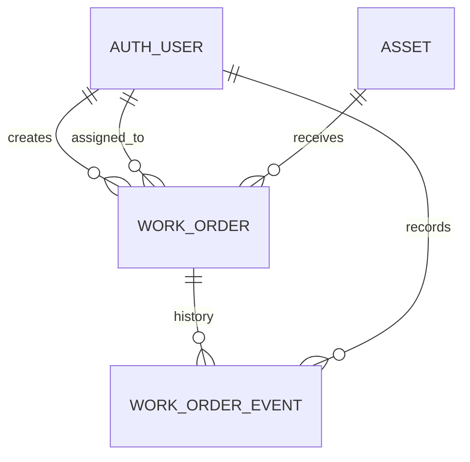

# Database design

Tables are managed by Django migrations. `Asset.code` is unique. `WorkOrder.asset` and user references are protected from deletion. Status and priority are indexed for dashboard queries. WorkOrderEvent is an append-only event record in the application workflow, though direct privileged database/admin access is outside this application guarantee.
